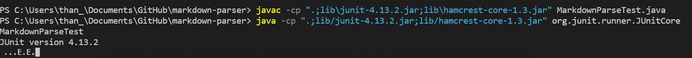

# Lab Report 2 - Week 4

## Code Change #1

With the original implementation, there was an infinite loop with a heap error. Such as in our test file [test2.md](https://github.com/hthan18/cse15l-lab-reports/blob/main/test2.md), we see this result in the terminal:

The infinite loop is caused in the code as it searches for the square brackets of the link. If both are not found, the code goes into an infinite loop as it searches for the finished product.

## Code Change #2

Before our while loop is executed, we have added if statements to check for both regular and square brackets in our test markdown files.

Beforehand, in our [test3.md](https://github.com/hthan18/cse15l-lab-reports/blob/main/test3.md) file, we would be met with a thrown index out of bounds error.

## Code Change #3

The code change here will return an empty array list if the brackets are not found.

The error that we were prompted with was:

The infinite loop occurs because of the if statements not present checking for the brackets. Without those statements, an empty array is just returned.

