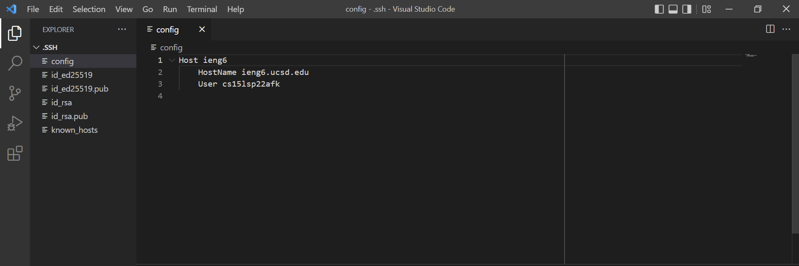
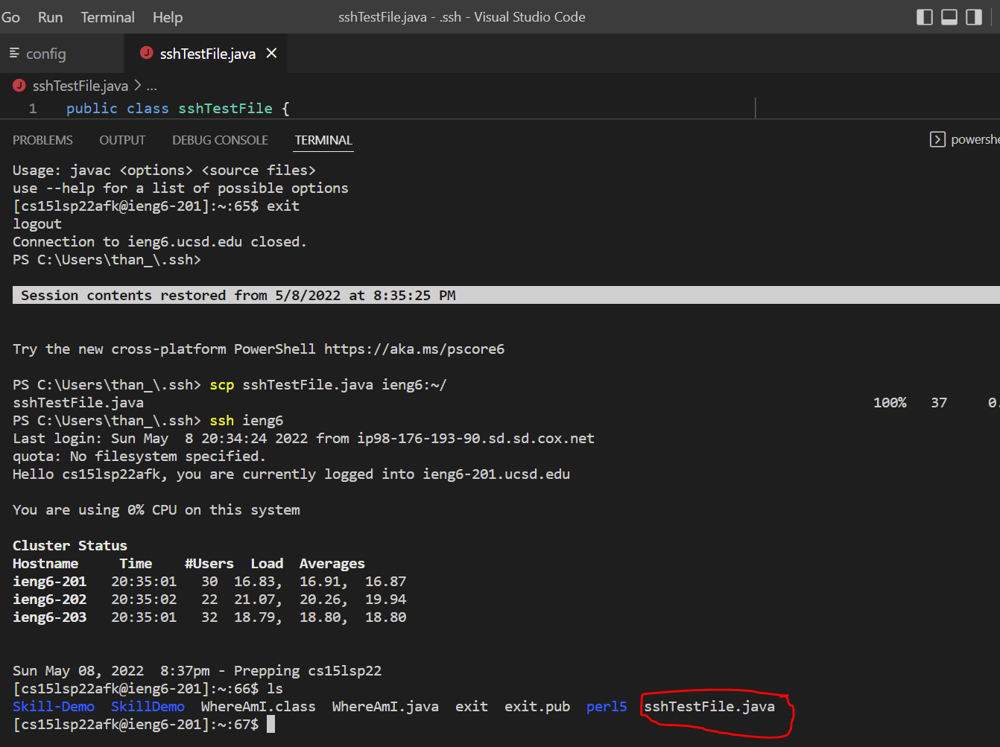
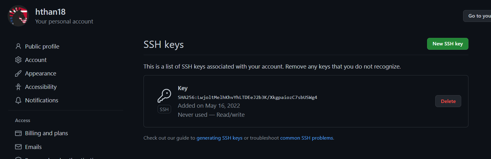
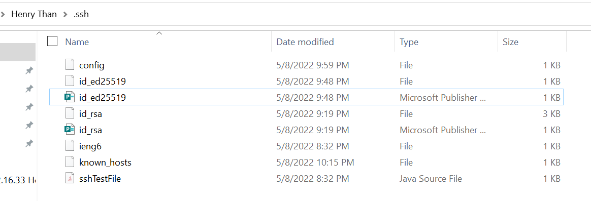

# Lab Report 3 - Week 6

## Streamlining ssh Configuration

* Here is the ssh config file that was modified in VSCode to use the alias ieng6
    
* Here I was able to log into the remote servers just using the alias ieng6
    
* Here I am using the scp command to copy over a file to my account just using the alias ieng6
    

## Setup Github Access from ieng6

* This is where the public key is stored on Github

* This is where the private key is stored on my PC

