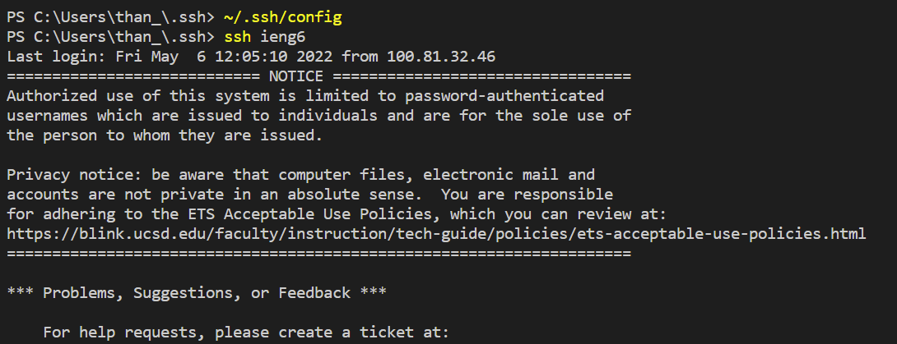

# Lab Report 3 - Week 6

## Streamlining ssh Configuration

* Here is the ssh config file that was modified in VSCode to use the alias ieng6
    
* Here I was able to log into the remote servers just using the alias ieng6
    
* Here I am using the scp command to copy over a file to my account just using the alias ieng6
    

## Setup Github Access from ieng6

* This is where the public key is stored on Github

* This is where the private key is stored on my PC

* Here I am running git commands to commit and push a change to Github while logged onto the remote server
Here is a link to the commit: [Repo Commit](https://github.com/hthan18/cse15l-lab-reports/commit/ad3a64c8f900cafe4977361ec892cdb7fc5f8043)

## Copy whole directories with scp -r

* Here I am copying my markdown-parse directory to my ieng6 account

* Here I am logging in and then compiling and running the tests

* Here is the commands combined to use scp and run the tests in just one line

