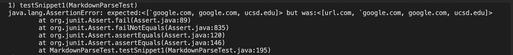
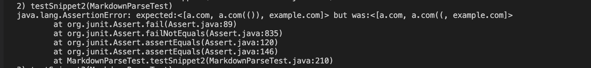
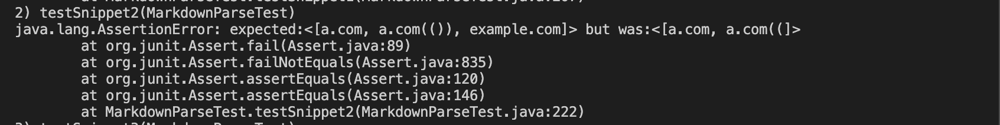
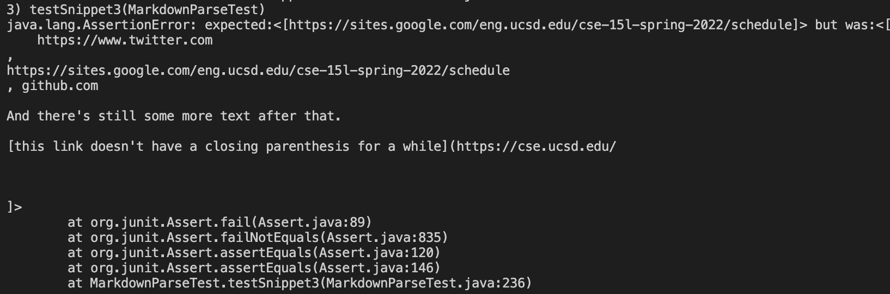
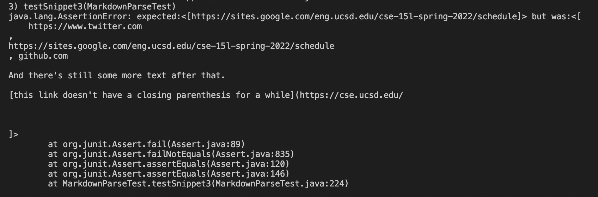

# Lab Report 4 - Week 8

* My markdown-parse repository: [markdown-parse](https://github.com/hthan18/markdown-parser)
* The repository I reviewd [markdown-parse review](https://github.com/ohuynh21/markdown-parser)

## Test 1
For the first test using CommonMark, the expected result is **google.com, google.com, and ucsd.edu.**

My Implementation:

Reviewed Implementation:

I don't think a small code change would make the implementation work. The code now checks for brackets and thus parses the words inside and would need to be changed to pass.

## Test 2
For the second test, the expected result is **a.com, a.com(()), and example.com**

Reviewed Implementation:

A small code change (<10 lines) could be to check for the right parentheses. The thought process for this is that it would allow the code to be more flexible and allow nested parentheses.

## Test 3
For the third test, the expected result is https://sites.google.com/eng.ucsd.edu/cse-15l-spring-2022/schedule

Reviewed Implementation:

I don't think a small code change can work in this scenario because of the line breaks in this test. I feel the code would need to be revised in order to account for these type of edge cases.
