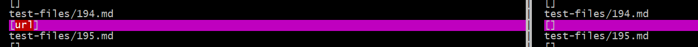
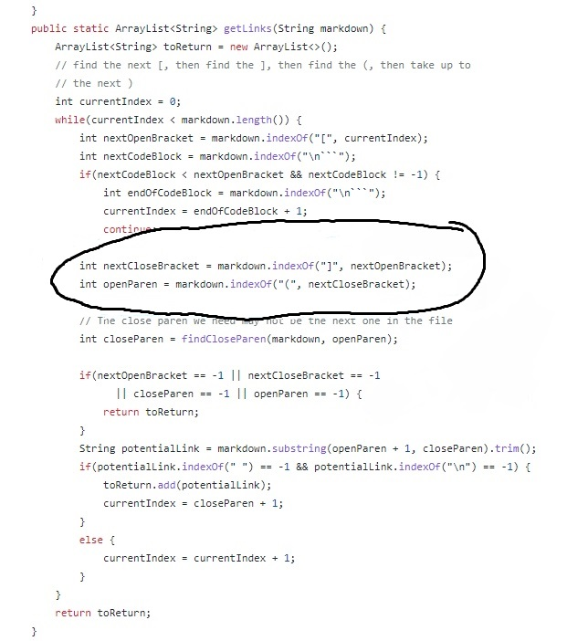
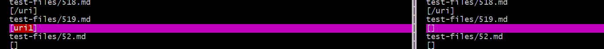
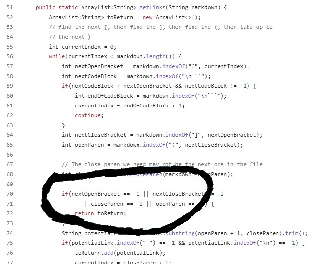

# Lab Report 5 - Week 10

## How I found the tests:
* I found the tests by running the script.sh file and saved the results. I compared the results using vimdiff.

## Test 1
* Both implementations gave the wrong output

* On the left side of this screenshot is the CSE15L implementation and on the right is mine.
The result expected is: **[my_url]**

* I'm not too sure on what the problem is with the program and how we are given an output with a valid link. In the circled region, I think there is something wrong with the parser. The references this code makes might be the reason for the wrong outputs.

## Test 2
* My code got the right output however the CSE15L implementation did not.

* Once again the left side is the CSE15L implementation and the right is mine.
* The expected result should be **[]**.

* In the circled region of this screenshot, I think the code doesn't account for the url in between an image. I think a fix that would account for this would be checking the index of the brackets and check for at least a space between the ! and open bracket.